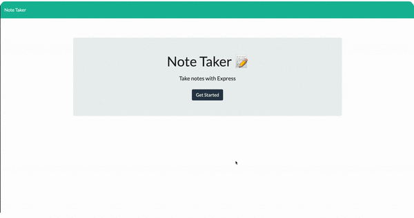

# Note-Taker

Get organized [here](https://damp-harbor-02616.herokuapp.com/)

## Introduction
If you're tired of making notes, lists, anything you need to remember for the day on scratch pieces of paper only to later on in the day "misplace" it because it was written on the back of a receipt (because that's what was within arms reach of when these tasks/epiphanies/whatever came into my mind) and come to find out it was thrown away, the kids added to your list with crayon and marker scribbles to the point that your writing not in any sort of language anymore, or you just lose things easily. The Note-Taker will make your day. By having all your notes safe from the trash, the kids, and whatever disasters come your way. 

## Description
 Note-Taker can be used to write, save, and delete notes to help with organizing your busy everyday life.

## Table of Contents

  - [Introduction](#introduction)
  - [Description](#description)
  - [Contributing](#contributing)
  - [License](#license)
  - [GitHub Repo, Profile, Questions](#github-repo-profile-questions)

## Contributing
1. Fork it!
2. Create your branch: `git checkout -b your branch name here`
3. Add and commit your changes
4. Push to your branch
5. Submit a pull request

## License

## GitHub Repo, Profile, Questions
* View [Note-Taker](https://damp-harbor-02616.herokuapp.com/) Live on Heroku
* [Repository](https://github.com/brandt-fricker/Note-Taker)
* [GitHub Profile](https://github.com/brandt-fricker)
* Any questions, comments, or concerns please feel free to contact me, all my info can be found [here](https://drive.google.com/file/d/1lZC64xhP2PnV-DXlreSIA11vyq-aKmZ2/view?usp=sharing)

